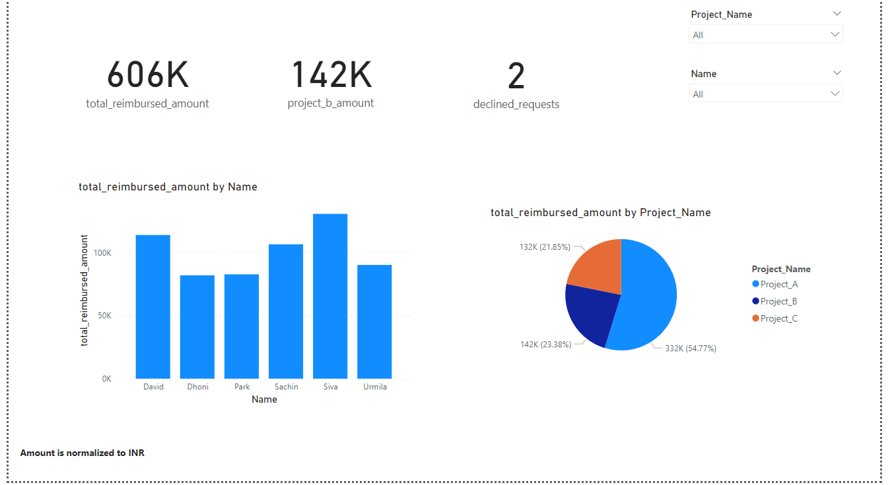

# Employee Reimbursement Analysis

## Analysis on Employee Reimbursement using various Power BI charts like Pie/Bar charts, KPI cards, Tables, Matrix and Slicers.

## The techniques used are Data modelling, Column Transformation and DAX formulas

